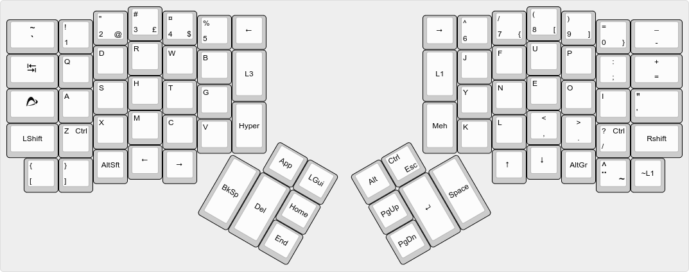

# ErgoDox EZ Libbum Configuration

Working from the [default configuration](http://qmk.fm/keyboards/ergodox/keymaps/default/) of the QMK firmware, this layout will at some stage in the future be used for my ErgoDox Infinity.

At the moment, it's a work in progress and probably not what you want to use.

## Keymap 0: Basic layer using Swedish locale.

## Keymap 3: Standard Workman

## License
